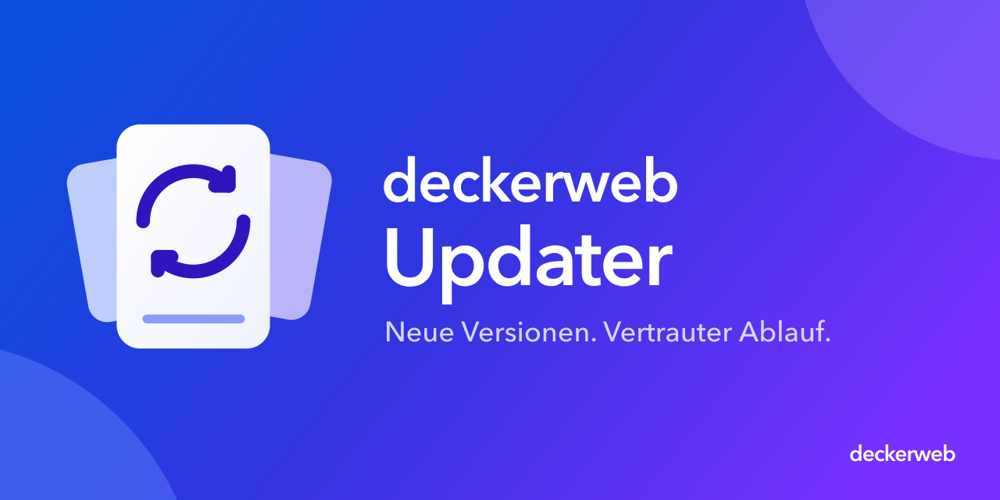

# deckerweb Updater

[English](README.md)

## Über den Updater

Der deckerweb Updater verbindet GitHub-Releases mit dem gewohnten WordPress-Updateablauf. Plugin-Autoren binden ihn in ihre Plugins ein; du nutzt weiterhin die vertraute Updateansicht. Öffentliche und private Repositories verwenden dieselbe Engine.

Dieses Repository enthält die wiederverwendbare PHP-Komponente, Tests, Einbindungsbeispiele und Dokumentation. Wenn du den Updater in einem Plugin findest, musst du kein zusätzliches Updater-Plugin installieren.

**Version:** 2.1.0 · PHP ≥ 8.1 · WordPress-Anforderungen richten sich nach dem Host; geprüft auf 6.7 und 7.1.2.

[Dokumentation](docs/INTEGRATION-de.md) · [FAQ](docs/FAQ-de.md) · [Sicherheit](SECURITY-de.md)

## Inhalt

- [Auf einen Blick](#glance)
- [Einbindung und erste Schritte](#installation)
- [Hauptfunktionen](#features)
- [Den Updater in deinem Plugin entdeckt?](#users)
- [Für Entwickler](#developers)
- [FAQ](#faq)
- [Changelog](#changelog)
- [Autor und Umfang](#author)
- [Fragen und Unterstützung](#support)

## Auf einen Blick

- GitHub-Releases im normalen WordPress-Updateablauf.
- Öffentliche Repositories ohne Zugangsdaten; private optional mit einem Provider.
- Release-ZIP-Dateien und Source-Archiv als Fallback.
- Vom Host bereitgestellte Icons, Banner und Plugininformationen.
- Alle Oberflächentexte in der bestehenden Textdomain des Host-Plugins.

## Einbindung und erste Schritte

**Für Plugin-Nutzer:** Aktualisiere das einbettende Plugin wie gewohnt unter **Dashboard → Aktualisierungen** oder **Plugins**. Der Plugin-Autor entscheidet über die Einbindung.

**Für Entwickler:** Einen festen Runtime-Versionsstand in den Host übernehmen, nach dem Übersetzungsstart registrieren und dessen vollständige Paketprüfung erhalten. Das Repository-ZIP ist ein Quellpaket der Komponente. Siehe [Einbindung](docs/INTEGRATION-de.md) und [Adaptervorlage](examples/host-adapter.php).

## Hauptfunktionen

### Ein Ablauf für GitHub-Updates

Veröffentlichte stabile Releases werden als Updates für das zugehörige Plugin angeboten. Entwürfe, Vorabversionen und ältere Versionen werden nicht angeboten. Der Updater schaltet automatische Updates nicht selbst ein.

### Öffentliche und private Repositories

Öffentliche Repositories behalten den Zugriff ohne Authentifizierung. Private beziehen Zugangsdaten über einen an das Repository gebundenen Provider. Temporäre URLs werden erst beim Download aufgelöst; der Token wird nicht an den Downloadhost weitergegeben.

### Die Identität des Hosts erhalten

Icons, Banner, Namen und Beschreibungen kommen vom Host. Release-Notizen erscheinen als maskierter Text im Plugindialog. Strukturierter Footer-Changelog und sprachabhängige Wiki-Links bleiben Hostfunktionen.

### Eine Textdomain pro Plugin

Der Host pflegt die Übersetzungskataloge. Ein Callback pro Instanz übersetzt Updater-Meldungen bei der Ausgabe; eine zusätzliche Updater-Textdomain wird nicht geladen.

## Den Updater in deinem Plugin entdeckt?

Für öffentliche Pluginupdates brauchst du keinen GitHub-Account oder Token. Private Updates benötigen installationsseitig verwaltete Zugangsdaten; dafür gelten die Einrichtungshinweise des Plugin-Betreuers. Ein Token wird nicht im Plugin mitgeliefert.

GitHub-Updateprüfungen und Paketdownloads verbinden sich mit externen Servern, die die anfragende IP-Adresse sehen können. Die Komponente enthält keine Analysefunktion. WordPress und der Host können nach ihren eigenen Regeln weitere Anfragen stellen.

Voraussetzungen, Aktivierung und Bereinigung beim Deinstallieren erklärt die Dokumentation des Host-Plugins. Siehe [Daten und Verbindungen](docs/DATA-de.md).

## Für Entwickler

Der Updater ist GPL-2.0-or-later. Du kannst ihn mit erhaltener Herkunfts- und Lizenzangabe untersuchen und wiederverwenden. Einstieg: [Einbindung](docs/INTEGRATION-de.md), [Authentifizierung](docs/AUTHENTICATION-de.md), [Tests](docs/TESTING-de.md) und [Release-Konventionen](docs/CONVENTIONS-de.md).

Vor Austausch eines installierten Plugins muss der Host die tatsächliche Paketidentität, Update-URI, angebotene Version und WP-/PHP-Anforderungen prüfen. Diese Prüfung muss bei Einzel- und Sammelupdates greifen. Bei parallel geladenen älteren V2-Kopien die benötigten Fähigkeiten prüfen.

## FAQ

### Installiere ich ein eigenes Updater-Plugin?

Nein. Der Host bindet einen festen Versionsstand ein. Nutze die üblichen Installations- und Updateschritte des Host-Plugins.

### Brauchen öffentliche Updates einen GitHub-Token?

Nein. Öffentliche Repositories bleiben ohne Authentifizierung. Nur entsprechend konfigurierte private Repositories benötigen Zugangsdaten.

### Kann ich Updates aus einem privaten Repository erhalten?

Ja. Der Host muss den Private-Modus aktivieren und einen repositorygebundenen Provider bereitstellen. Ein Fine-grained PAT mit Contents read und Metadata read unterstützt die geprüften Release- und Archivendpunkte.

### Schaltet der Updater automatische Updates ein?

Nein. Er unterstützt die normale WordPress-Update-Engine. Die Einstellung für automatische Updates bleibt bei WordPress und dem Host.

### Können mehrere Plugins V2 einbinden?

Ja, mit geschützter Klassenladung. Die zuerst geladene Klasse gilt; Private-/Übersetzungsfähigkeiten prüfen und die ausgelieferten Versionen abstimmen.

### Gibt es eine zusätzliche Textdomain?

Nein. Updater-Strings werden in die Hostkataloge übernommen und über einen Hostcallback übersetzt.

### Was passiert nach einem Tokenwiderruf?

Private Downloads werden auch bei noch gecachten Metadaten abgelehnt. Ein abgelehnter Download ersetzt das installierte Plugin nicht; das Aktivierungsverhalten verantwortet der aufrufende Hostablauf.

[Alle Fragen nach Themen](docs/FAQ-de.md).

## Changelog

### 2.1.0 · 2026-10-06

- **Neu:** Private GitHub-Updates über einen repositorygebundenen Authentifizierungsanbieter.

- **Neu:** Updater-Meldungen verwenden die bestehende Host-Textdomain, einschließlich deutscher Du-/Sie-Kataloge.

- **Verbessert:** Authentifizierte Release-Assets und Source-Archive nutzen denselben nativen WordPress-Updateablauf.

- **Verbessert:** Tokenrotation unterstützt die ausdrückliche Invalidierung des Metadatencaches.

- **Behoben:** Private Downloads und Archivnormalisierung berücksichtigen den Core-Bulk-Kontext je Paket.

- **Sonstiges:** Bestehende Public-Aufrufe, lokale Grafiken und Releaseinformationen bleiben erhalten.

## Autor und Umfang

Entwickelt und betreut von David Decker — DECKERWEB. Gemeinsame eingebettete Komponente für über GitHub vertriebene WordPress-Plugins.

## Fragen und Unterstützung

Für Fragen zur Komponente und nachvollziehbare Fehler ohne sensible Angaben stehen die [Issues](https://github.com/deckerweb/deckerweb-updater/issues) zur Verfügung. Einbindungsspezifische Pluginfragen gehören zum jeweiligen Host-Betreuer. Lies vor Meldung einer möglichen Sicherheitslücke die [Sicherheitshinweise](SECURITY-de.md).

[Ko-fi](https://ko-fi.com/deckerweb) · [Buy Me a Coffee](https://buymeacoffee.com/daveshine) · [PayPal](https://paypal.me/deckerweb)

## Copyright und Lizenz

Copyright © 2026 David Decker — DECKERWEB. GPL-2.0-or-later. [LICENSE](LICENSE) · [Assets](docs/ASSETS-de.md).
