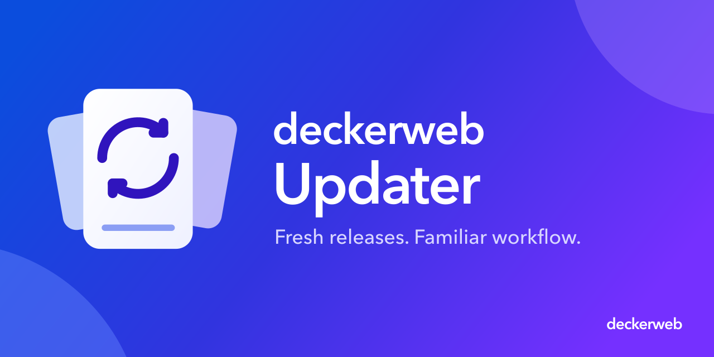

# deckerweb Updater

**Fresh releases. Familiar workflow.**

The deckerweb Updater connects GitHub releases to the normal WordPress plugin update workflow. Plugin authors embed it in their plugins; users keep the familiar update screen. Public and private repositories share the same engine.

This repository contains the reusable PHP component, tests, integration examples and documentation. If you find it inside a plugin, you do not need to install an additional updater plugin.

- [Integration](Integration)
- [Authentication](Authentication)
- [Data](Data)
- [Testing](Testing)
- [Validation](Validation)
- [Conventions](Conventions)
- [Assets](Assets)
- [Glossary](Glossary)
- [Security](Security)
- [FAQ](FAQ)
- [Changelog](Changelog)
